# PDER – Projeto da Disciplina de Engenharia de Requisitos

## INTRODUÇÃO 

Neste  projeto, propomos estabelecer um modelo para desenvolver um software  para uso no processo seletivo da empresa,  visando garantir a integridade da informação armazenada assegurando a veracidade dos relatórios gerados.

## IDENTIFICAÇÃO DO PROBLEMA

Atualmente, o cliente mantém todos os dados referente ao processo seletivo, armazenados em uma planilha do Excel, que faz uso de fórmulas para contabilizar as médias e classificação nas 16 disciplinas aplicadas aos concorrentes do processo seletivo.

## DESCRIÇÃO DA SOLUÇÃO

Propomos desenvolver um software, para controlar este processo, oferecendo telas intuitivas para 
Cadastros, lançamentos, gerar e visualizar relatórios de classificação e emissão de certificado de conclusão. Sendo armazenados em um banco de dados, para futuras consultas.

## ANALISE DE REQUISITOS

Em reunião o cliente apresentou sua planilha onde visualizamos os dados inseridos em suas devidas “abas”, informou todos os dados obrigatórios a serem utilizados, os métodos para calculo da média final e classificação, o “peso” de cada prova aplicada para  validar o processo seletivo. Apresentou também o escopo do certificado de conclusão e apontou os campos que devem ser preenchidos com os resultados do processo seletivo.

## REQUISITOS FUNCIONAIS

| Identificador | Descrição | Prioridade | Regra de Negócio |
|---------------|-----------|------------|------------------|
| RF-01         | Login de acesso |  alta|   RNE – 01       |
| RF-02         | Cadastrar usuário, Cadastrar aluno, Cadastrar professor | alta |
| RF – 03       | Lançar e Editar nota das provas | alta |
| RF – 04       | Gerar e visualizar: relatórios com classificação atualizada em tempo real dos candidatos nos concursos vigentes, Emitir certificado de conclusão para os   candidatos aprovados. | alta | RNE – 02, RNE - 03 | 

## DESCRIÇÃO DOS REQUISITOS NÃO FUNCIONAIS

Não se aplica.

## REGRA DE NEGÓCIO

| Identificador                         |                        Descrição         |
|---------------------------------------|------------------------------------------|
| RNE - 01 | Login com usuário e senha + token |
| RNE – 02 | Necessita sistema de avaliação com media de classificação 1º ao ultimo, separados em 2 semestres com 16 disciplinas cada uma com *até* 4 notas  já pré definida no cadastro. Métrica para avaliação: Media aritmética (MDA) com 3 casas decimais Média final (2xMDA+Comportamento / 3)
| RNE – 03 | aba cod alunos, disciplinas com notas, média, nota comportamental, aba apresentar em tempo real a classificação ao ser informado as notas, aba certificado sendo no verso o histórico do desempenho. |

## INTERFACES DOS SISTEMA

### WEB

<table>
    <tr>
        <td></td>
         <td>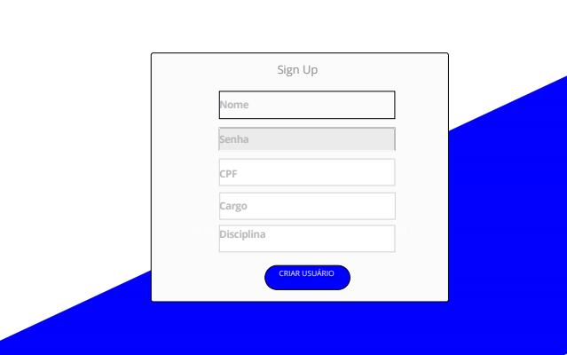</td>
        <td>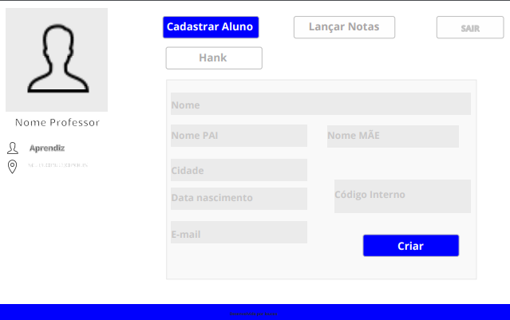</td>
    </tr>
    <tr>
        <td>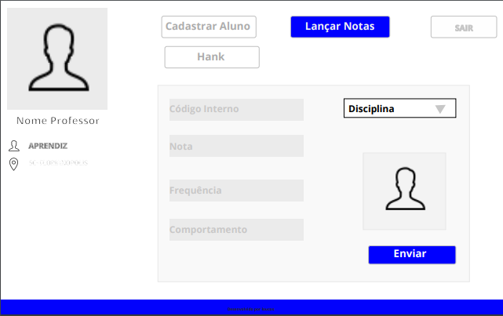</td>
        <td></td>
        <td>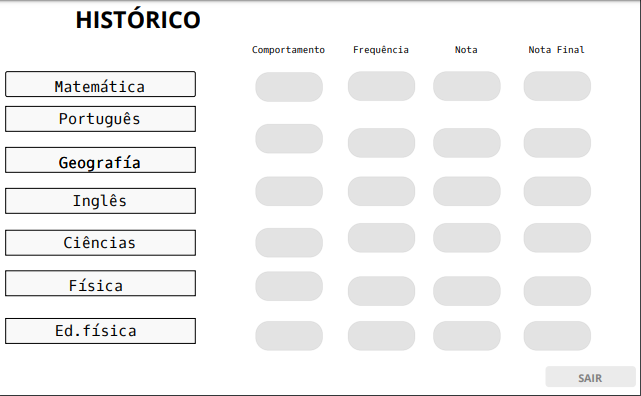</td>
    </tr>
     <tr>
        <td>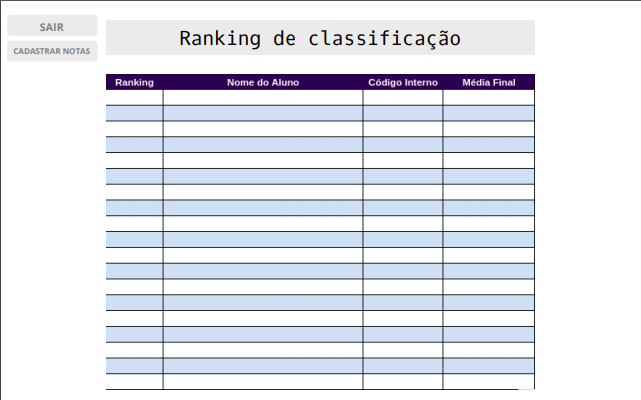</td>
        <td>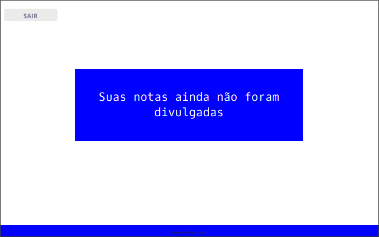</td>
        <td>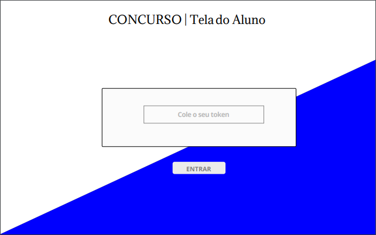</td>
    </tr>
    <tr>
        <td>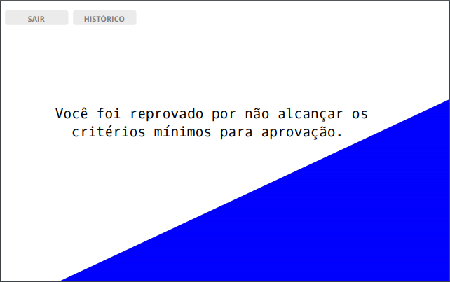</td>
    </tr>
</table>

### MOBILE 

<table>
    <tr>
        <td></td>
        <td></td>
        <td>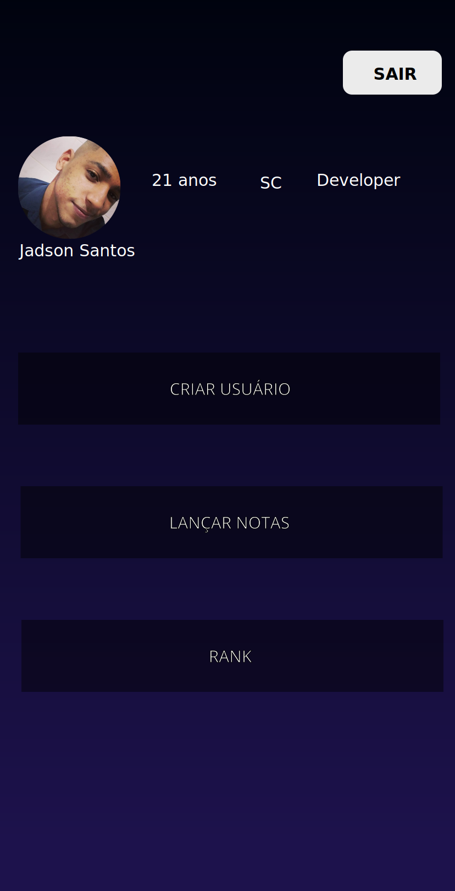</td>
    </tr>
    <tr>
        <td>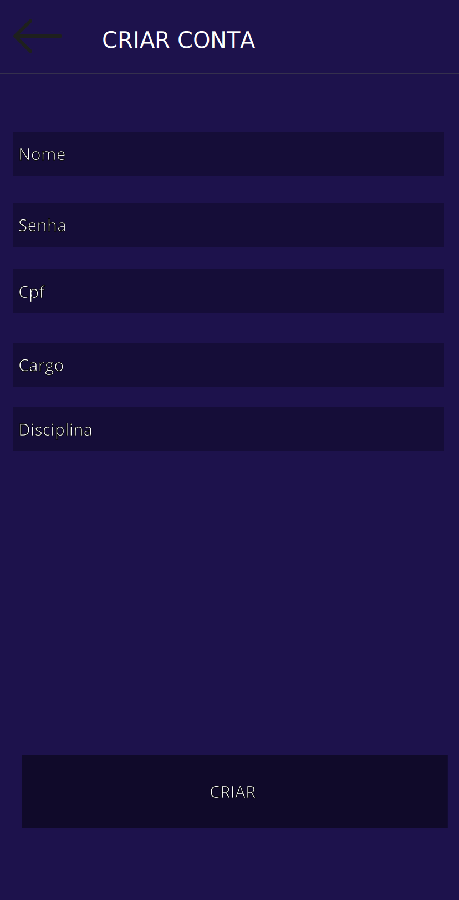</td>
        <td>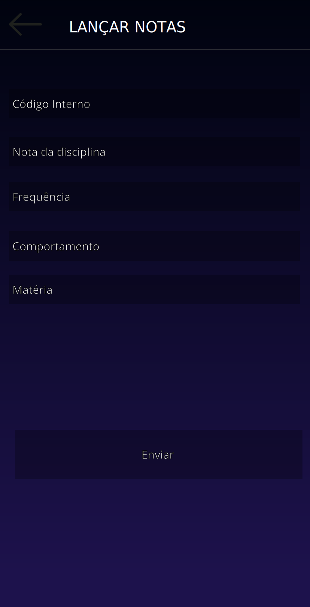</td>
    </tr>
     <tr>
        <td></td>
    </tr>
</table>

